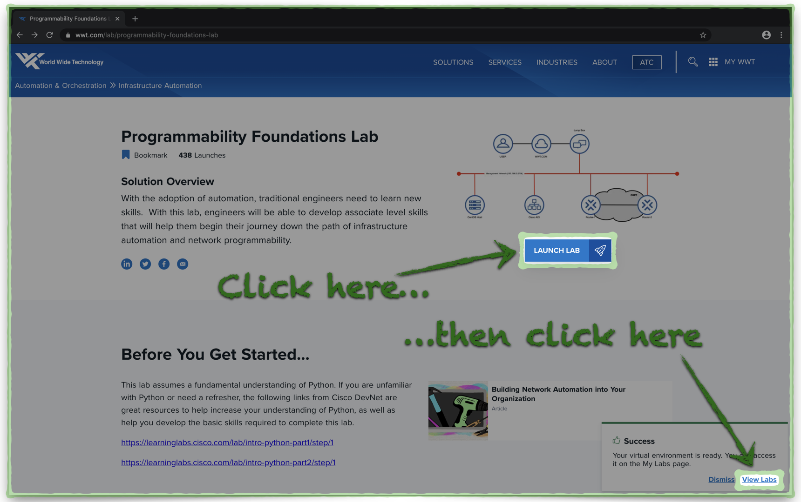
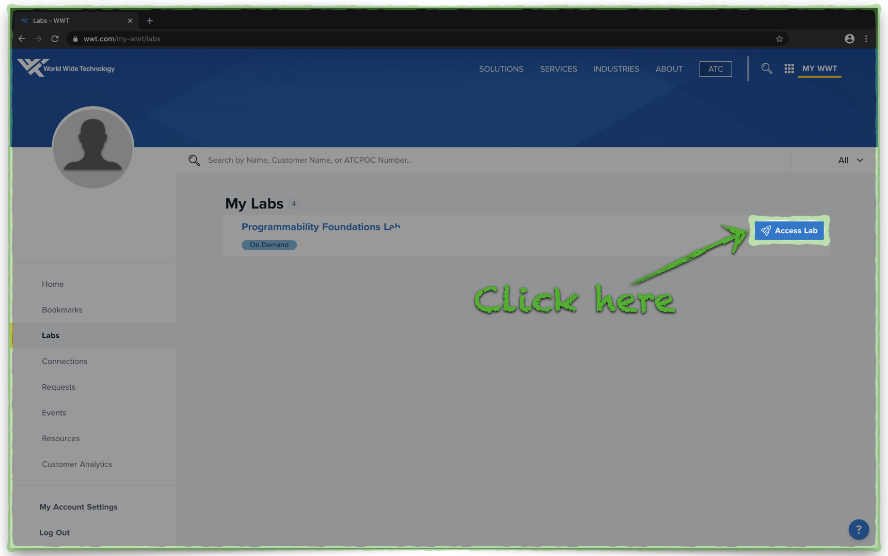
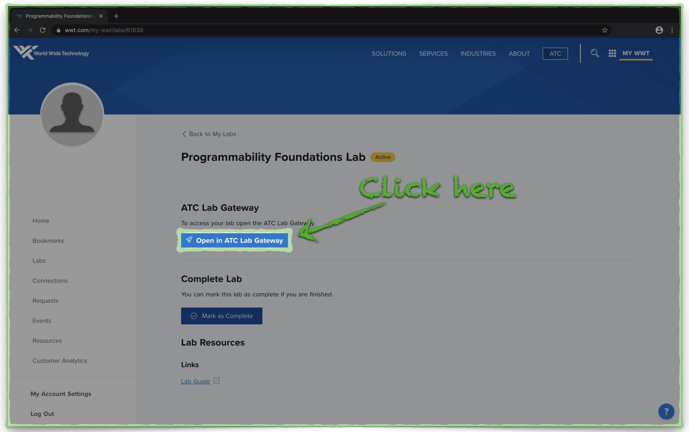
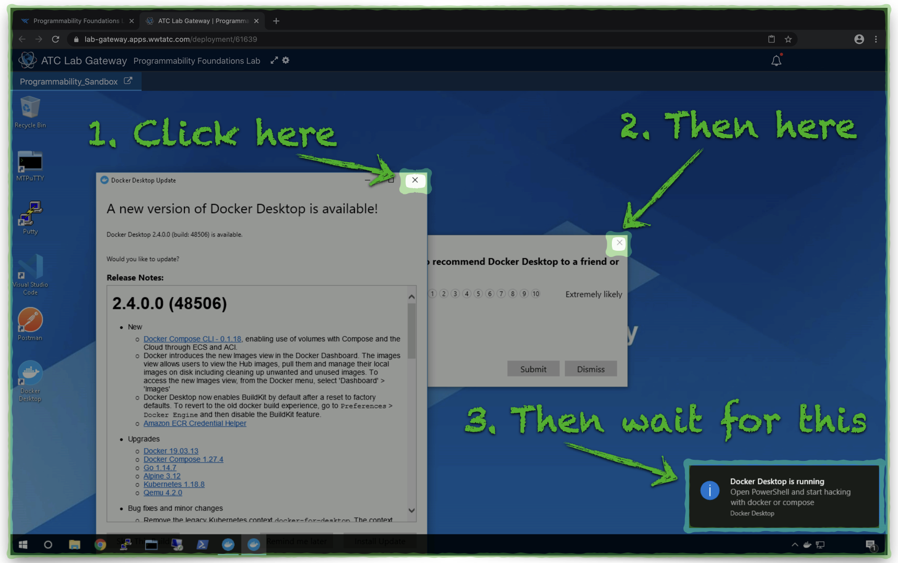
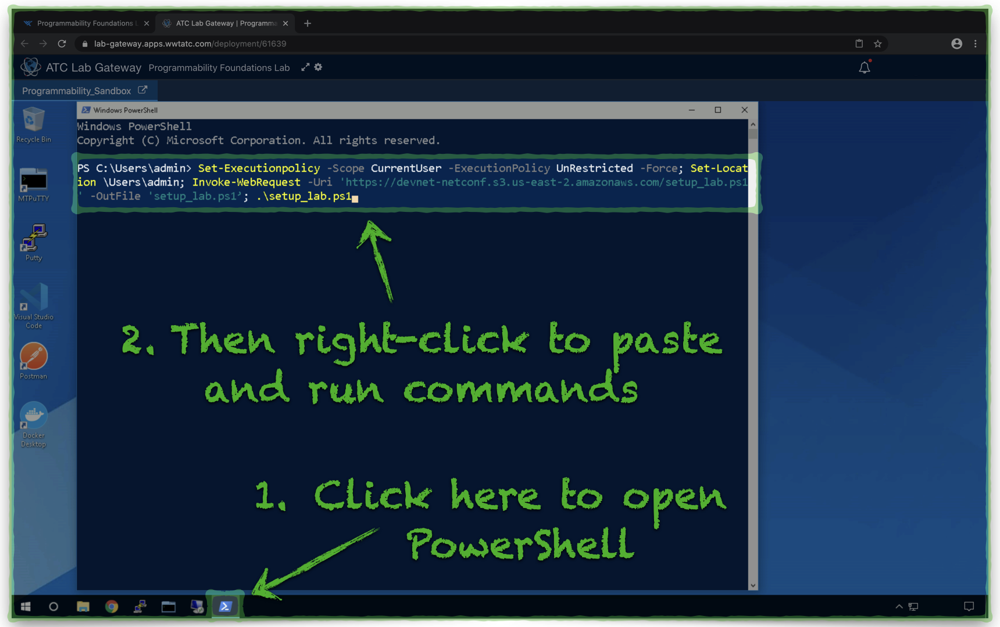
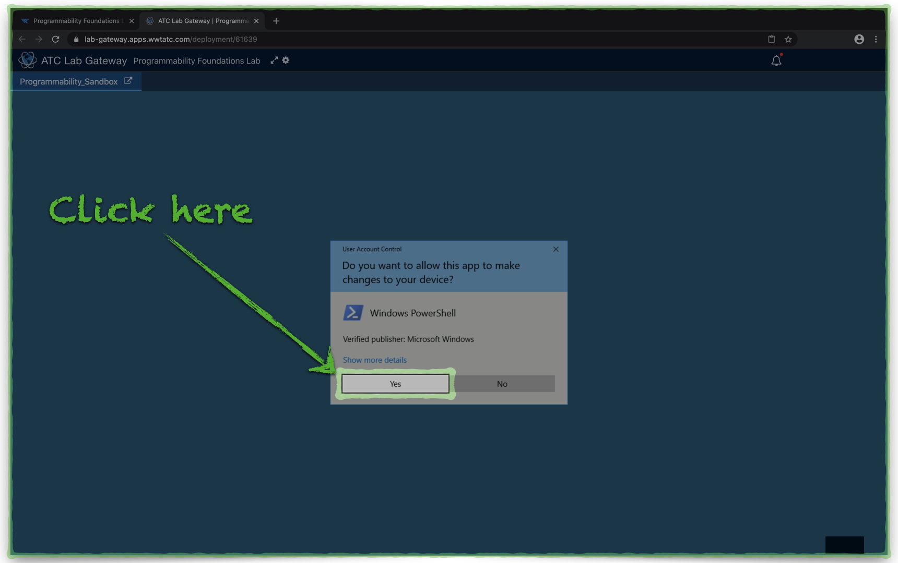
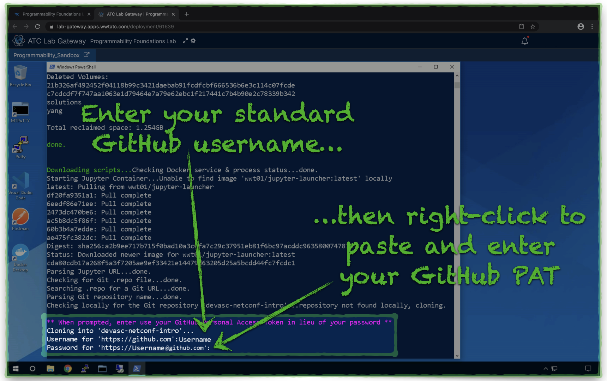
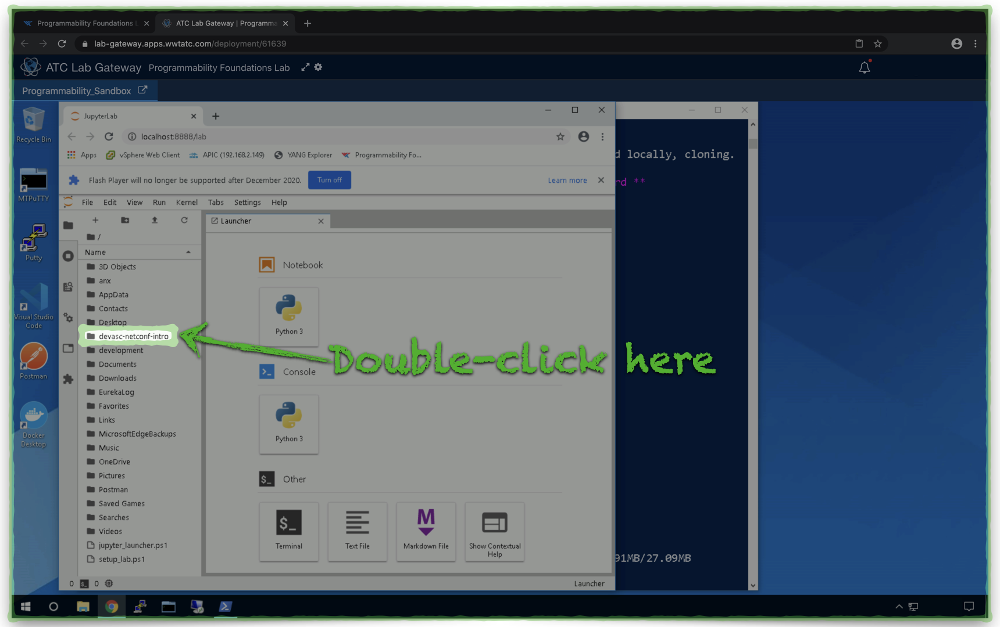
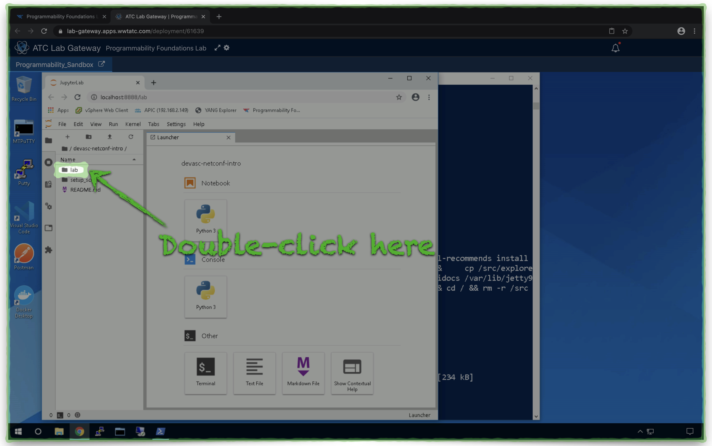
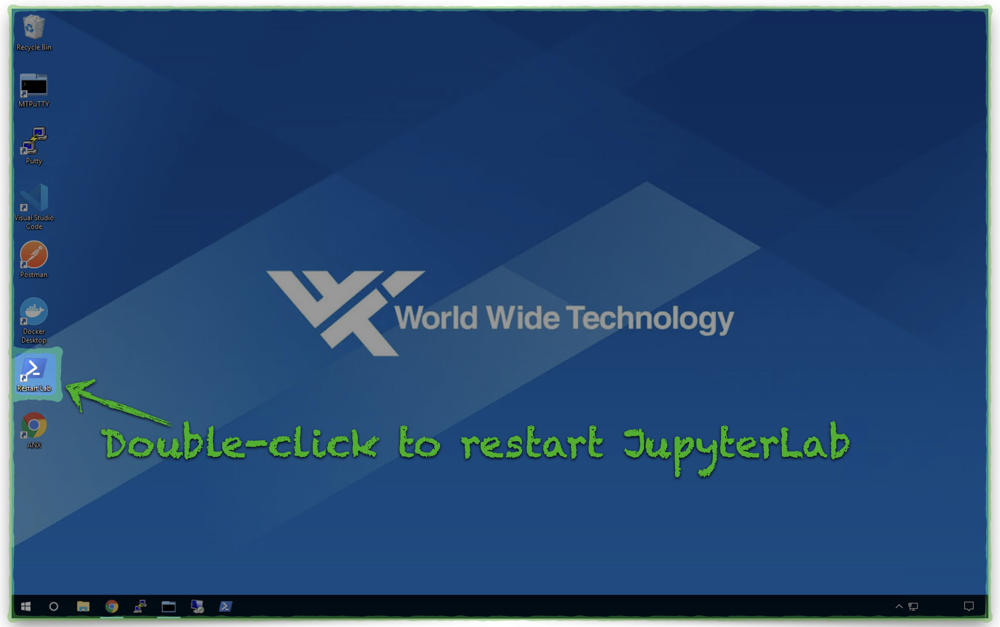

# DEVASC Model-Driven Programmability

## Introduction to NETCONF

## Overview

This repo will guide you through hands-on Model-Driven Programmability (MDP) NETCONF exercises with Cisco CSR1000v devices.  The excercsies support the learning objectives in sections 3.8, 5.1, 5.10, and 5.11 in the [Cisco DEVASC exam topics](https://learningnetwork.cisco.com/s/devnet-associate-exam-topics).

The **Lab Setup** section has step-by-step directions to help you access the learning materials using [JupyterLab](https://jupyterlab.readthedocs.io/en/stable/getting_started/overview.html) within the WWT [Programmability Foundations Lab](https://www.wwt.com/lab/programmability-foundations-lab).

\*\* Note - this lab requires that you have a **GitHub *Personal Access Token (PAT)*** available with ***repo*** scope permissions \*\*

* You will authenticate to GitHub using your standard GitHub username and substitute your PAT for your password.
* Directions to setup a PAT are here -  [GitHub Personal Access Token Setup](https://docs.github.com/en/enterprise/2.15/user/articles/creating-a-personal-access-token-for-the-command-line).
* If you are a WWT employee, be sure to **enable SSO** for your PAT.


*GitHub PAT SSO Setup*:


---


## Lab Setup

The lab setup process is almost entirely automated and leverages the **Cisco CSR 1000v devices** in the WWT Programmability Foundations Lab](https://www.wwt.com/lab/programmability-foundations-lab). 

**\*\*Plan for the automated lab setup to take 5-10 minutes\*\***.  Follow these steps to setup the lab environment:

1. Launch a new copy of the [][Programmability Foundations Lab](https://www.wwt.com/lab/programmability-foundations-lab) and click [View Labs](https://www.wwt.com/my-wwt/labs):




2. From the [My Labs](https://www.wwt.com/my-wwt/labs) page, click **Access Lab**:




3. Click the **Open in ATC Lab Gateway** button:




4. Close the two **Docker Update** windows and wait for the Windows notification which reads **Docker Desktop is running**:




5. Click the PowerShell icon in the task bar to open a new PowerShell window.  Then, copy the entire command below, **right-click** in the PowerShell window to the command, and press your *Return/Enter* key to run the command:

```powershell
Set-Executionpolicy -Scope CurrentUser -ExecutionPolicy UnRestricted -Force; Set-Location \Users\admin; Invoke-WebRequest -Uri 'https://devnet-netconf.s3.us-east-2.amazonaws.com/setup_lab.ps1' -OutFile 'setup_lab.ps1’; .\setup_lab.ps1
```





6. When prompted, click **Yes** to allow PowerShell to make changes to Windows:




7. After a few minutes, when prompted, enter your standard GitHub username and **substitute your PAT for your password**.
   - **Right-click** in the PowerShell window to paste your GitHub PAT:




8. A Chrome browser will open JupyterLab when the lab is ready to use.  Open the folder **devasc-netconf-intro**:




9. Open the **lab** folder and follow the instructions in the Jupyter Notebook **ncclient.ipynb** to go through the lab exercises:




10. The setup process creates a **Restart Lab** shortcut on the Windows desktop which will re-launch JupyterLab, in the event the Chrome tab closes, Windows restarts, etc.
   - This shortcut **only** re-launches JupyterLab, which takes a few seconds, and does not restart the 5-10 minute lab configuration process.
   - **You will NOT lose any of your lab progress **.




---

