# DEVASC Model-Driven Programmability

## Introduction to NETCONF

## Overview

This repo will guide you through hands-on Model-Driven Programmability (MDP) NETCONF exercises with Cisco CSR1000v devices.  The excercsies support the learning objectives in sections 3.8, 5.1, 5.10, and 5.11 in the [Cisco DEVASC exam topics](https://learningnetwork.cisco.com/s/devnet-associate-exam-topics).

The **Lab Setup** section of this document has step-by-step directions to help you access the learning materials using [JupyterLab](https://jupyterlab.readthedocs.io/en/stable/getting_started/overview.html) within the WWT [Programmability Foundations Lab](https://www.wwt.com/lab/programmability-foundations-lab).

:bangbang: ​Note - this lab requires that you have a **GitHub *Personal Access Token (PAT)*** available with ***repo*** scope permissions. 

* You will authenticate to GitHub using your standard GitHub username and substitute your PAT for your password.
* Directions to setup a PAT are here -  [GitHub Personal Access Token Setup](https://docs.github.com/en/enterprise/2.15/user/articles/creating-a-personal-access-token-for-the-command-line).
* If you are a WWT employee, be sure to **enable SSO** for your PAT.


*GitHub PAT SSO Setup*:

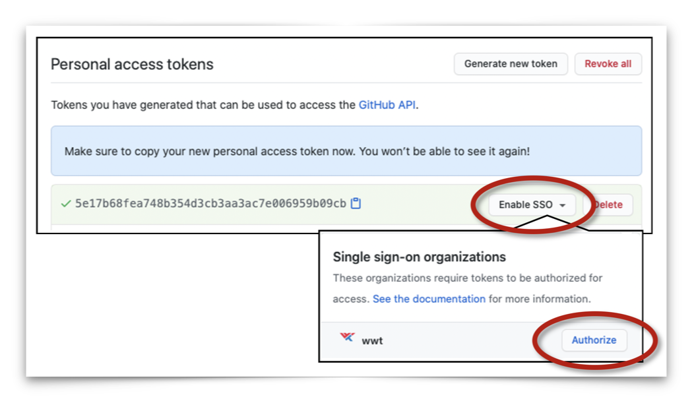

---


## Lab Setup

The lab setup process is almost entirely automated and leverages the **Cisco CSR 1000v devices** in the WWT [Programmability Foundations Lab](https://www.wwt.com/lab/programmability-foundations-lab). 

:clock1: **Plan for the automated lab setup to take 5-10 minutes**.  Follow these steps to setup the lab environment:

1. Launch a new copy of the [][Programmability Foundations Lab](https://www.wwt.com/lab/programmability-foundations-lab) and click [View Labs](https://www.wwt.com/my-wwt/labs):

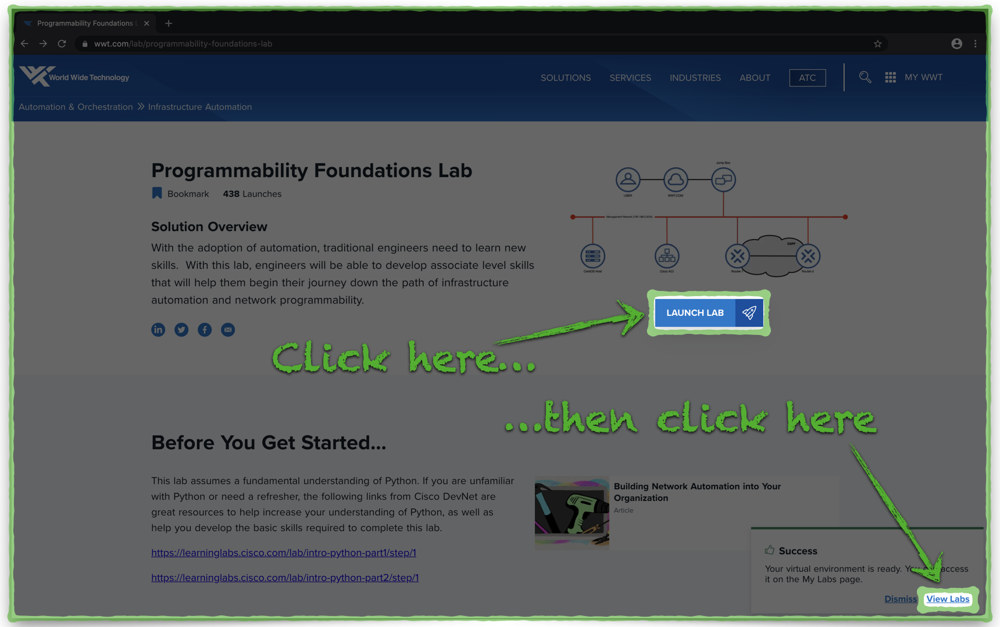


2. From the [My Labs](https://www.wwt.com/my-wwt/labs) page, click **Access Lab**:

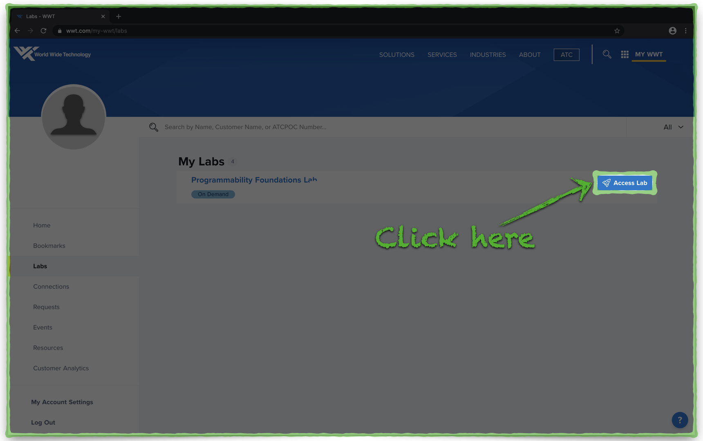


3. Click the **Open in ATC Lab Gateway** button:


4. Click the System Tray icon and mouse over the **Docker icon** to reveal the status.
   - :clock1: The icon may take a minute or so to appear.

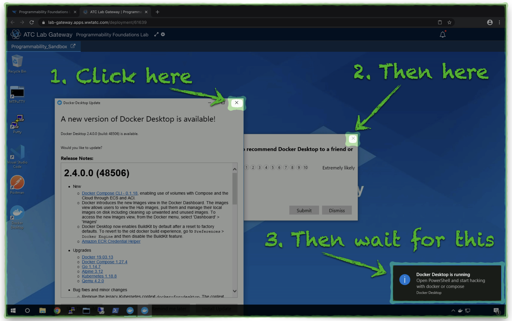


5. The Docker service is ready when a small exclamation point appears over the **Docker icon**.
   - :clock1: It may be a few minutes before the Docker service is ready

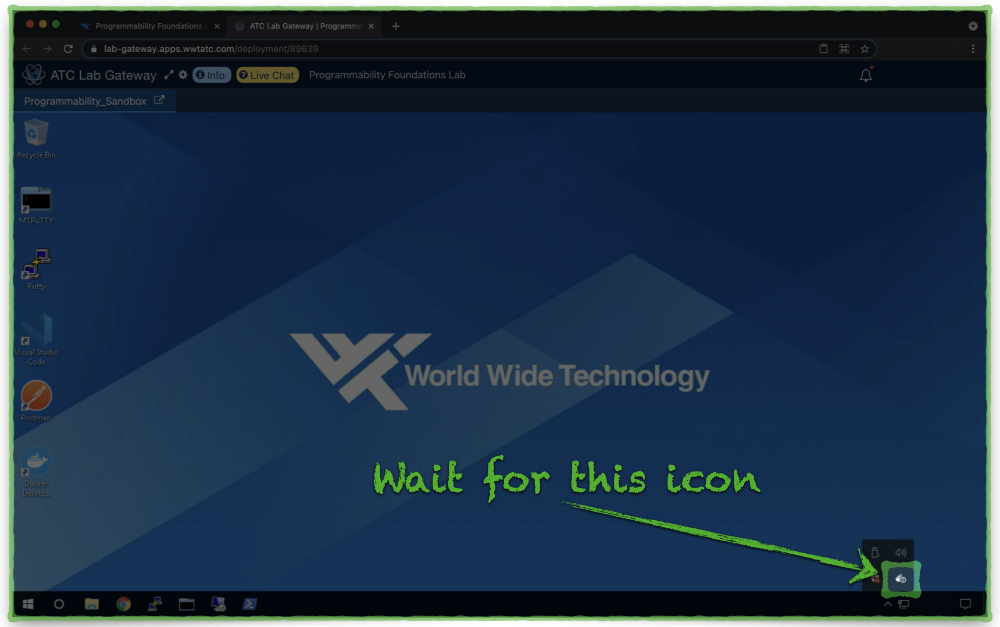


---

:heavy_exclamation_mark: Occasionally, the Docker Desktop service does not start on its own.  Windows may ask you if you want to start the Docker service and thereafter request permission for **Net Command​** to run.  You may safely confirm both actions.

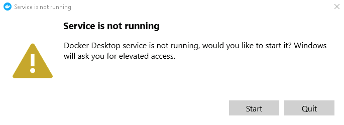

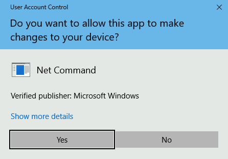

---


6. Click the PowerShell icon in the task bar to open a new PowerShell window.  Then, copy the entire command below to your clipboard, **right-click** in the PowerShell window to paste the command, and press your *Return/Enter* key to run the command:

```powershell
Set-Executionpolicy -Scope CurrentUser -ExecutionPolicy UnRestricted -Force; Set-Location \Users\admin; Invoke-WebRequest -Uri 'https://devasc-netconf.s3-us-west-2.amazonaws.com/setup_lab.ps1' -OutFile 'setup_lab.ps1’; .\setup_lab.ps1
```


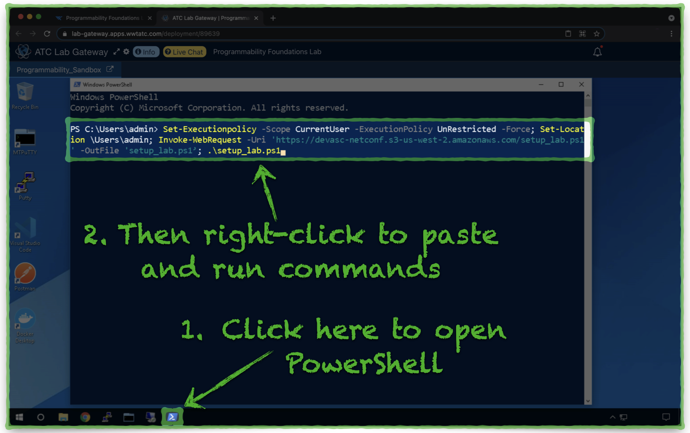


 :bangbang:If the PowerShell script exits with a message indicating that the **Docker process is not started**, refer to the **Troubleshooting** section at the bottom of this document .


7. After a few minutes, when prompted, enter your standard GitHub username.
   
   -  :heavy_exclamation_mark:When prompted, **substitute your PAT for your password**.:heavy_exclamation_mark:
   
   - **Right-click** in the PowerShell window to paste your GitHub PAT:

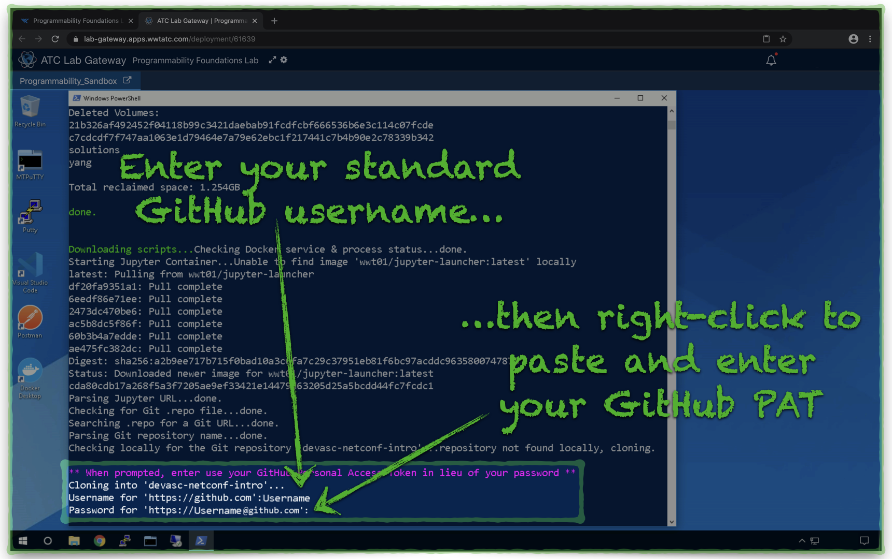


8. Within a few minutes, when the lab is ready to use, a Chrome browser will open a **JupyterLab** URL.
   - Open the folder **devasc-netconf-intro**.

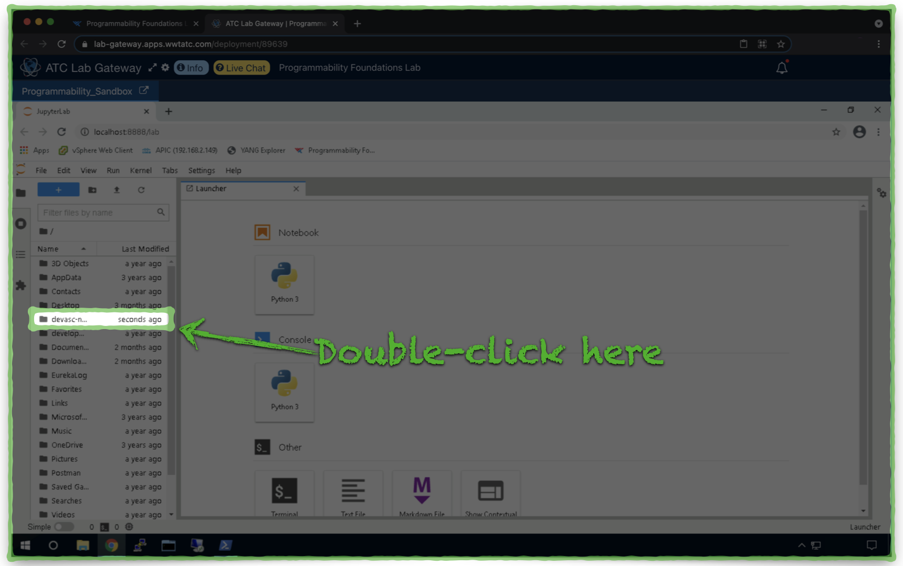


9. Next, open the **lab** folder.

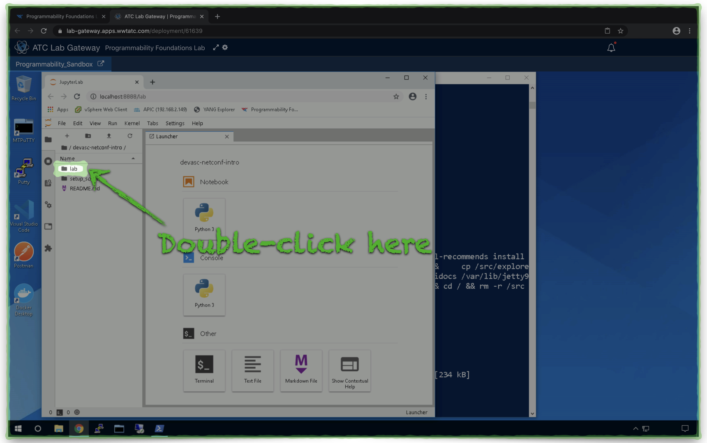


10. Open the **Jupyter Notebook** file named **ncclient.ipynb**

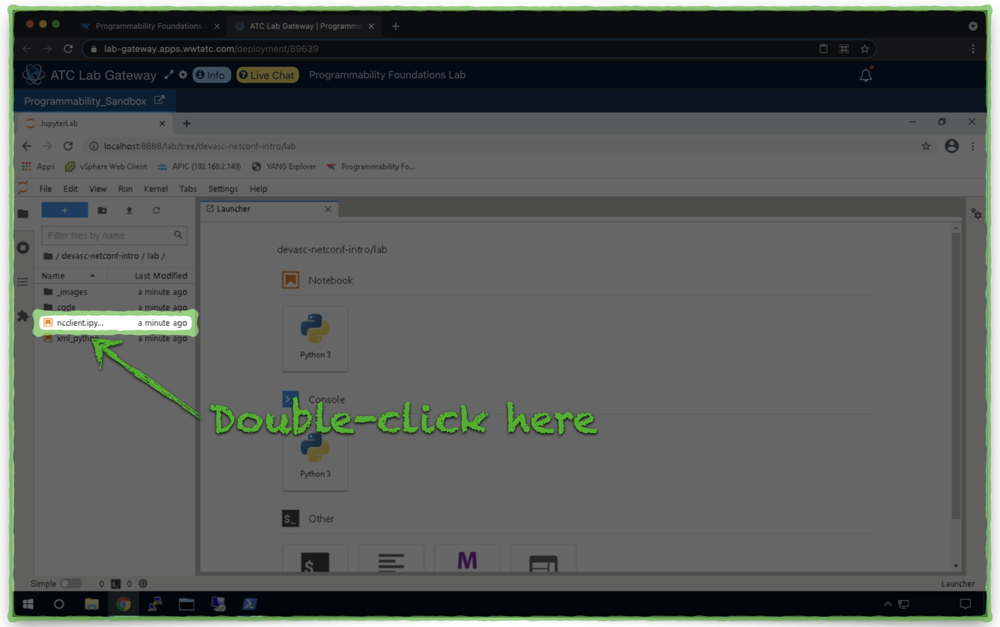


11. The NETCONF lab walkthrough guide will open and JupyterLab deployed correctly.

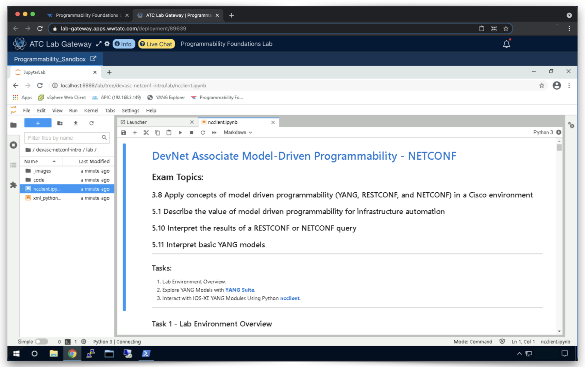


12. The PowerShell script will continue to run, behind the Chrome browser window, and deploy the **YANG Suite** application.
    
    - When the YANG Suite deployment completes, a second Chrome browser tab will open.
    
      :bangbang: You do **not** need to log on to YANG Suite at this time.
    
    - :white_check_mark: The automated lab setup should be complete and the PowerShell window will display a message to indicate whether or not setup was successful.

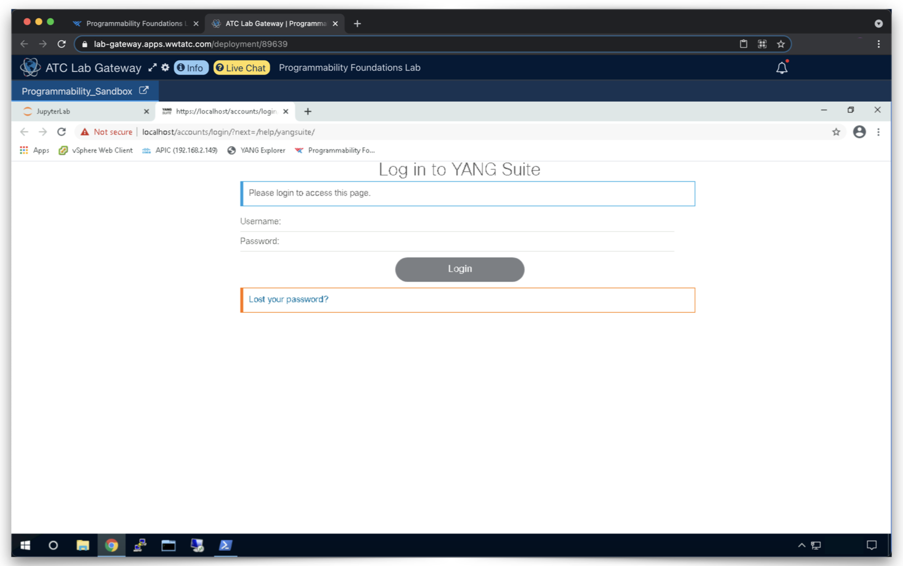


13. The setup process creates a two shortcuts on the Windows desktop which will help you restore the lab environment, in the event the Chrome tab closes, Windows restarts, etc.

    - The **Restart Lab** shortcut re-launches JupyterLab (including the Chrome browser tab), which takes a few seconds, and does not restart the entire 5-10 minute lab configuration process.
    - The YANG Suite shortcut will reopen the YANG Suite Chrome browser tab.

:large_orange_diamond: **Double-clicking these links will NOT cause you to lose any of your lab progress **:large_orange_diamond:

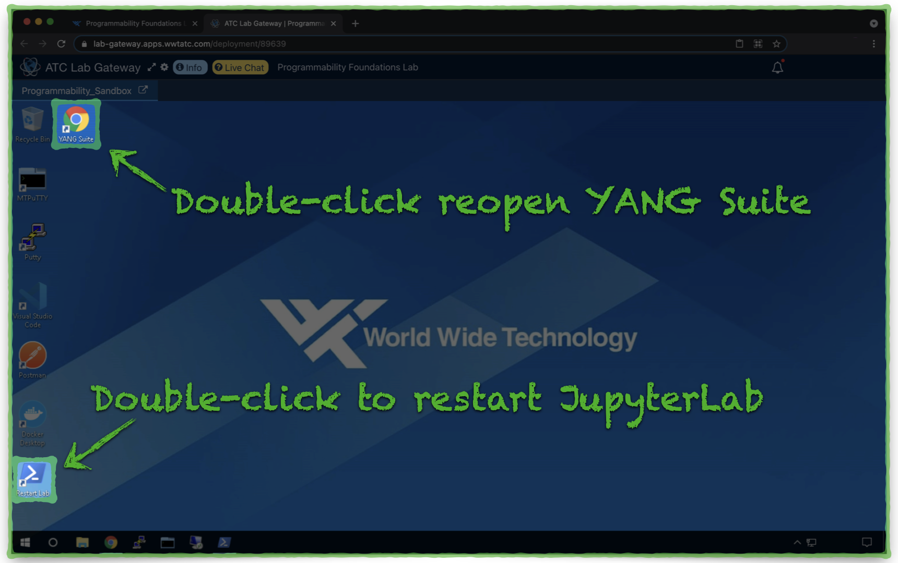


---

## Docker Troubleshooting

From time-to-time, Windows takes a lenghty amount of time to successfully start the Docker Desktop process and rarely, Windows will fail to start Docker Desktop.  If Windows cannot start Docker Desktop, your first indication will be an error message when you run the PowerShell script which configures the lab.

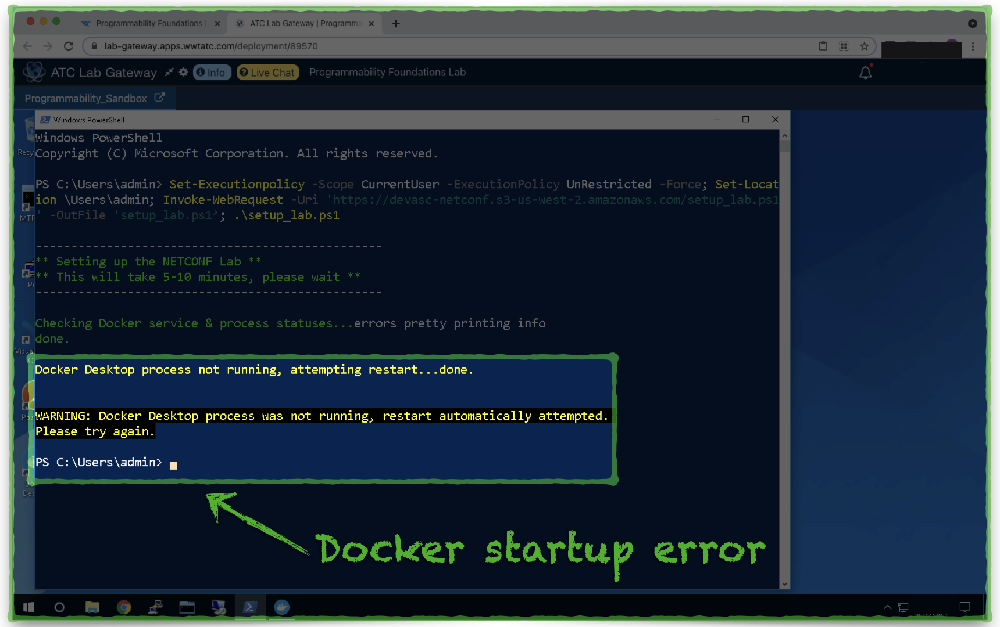


As the error message indicates, PowerShell will attempt to start or restart the Docker Desktop process.  After a few seconds, the Docker Desktop application will open behind the PowerShell and you may bring it to the foreground to monitor the status.

* A **teal**-colored icon in the lower-left corner of the Docker Desktop application indicates the Docker process is running and you should be able to re-run the PowerShell script to configure the lab environment.  Sometimes, Windows takes 5-10 minutes to start the Docker process.
* An **orange**-colored icon in the lower-left corner of the Docker Desktop application indicates the Docker process is **not** running and you have a couple of options:
  * Wait up to 10 minutes to see if Windows is able to start the Docker process.
  * Launch a new instance of the [Programmability Foundations Lab](https://www.wwt.com/lab/programmability-foundations-lab).

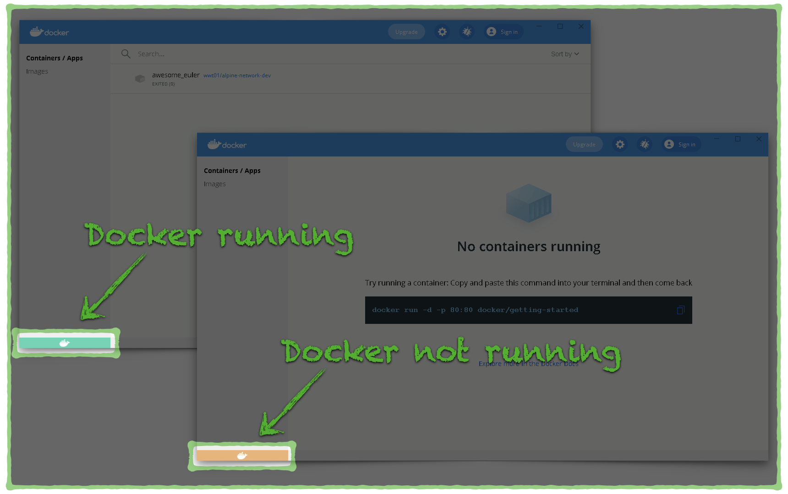