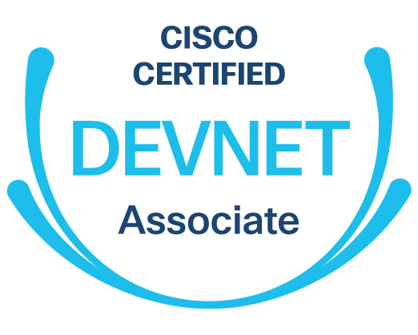

# Cisco DevNet Associate NETCONF Introduction Hands-On Lab Guide

## Overview

What's the big fuss over IT automation?  Well, more than anything, the excitement is about the sorts of things that you _don't_ have to do when automation is on your side.  Things like _not_ having to either copy and paste configuration changes to dozens (maybe hundreds) of different systems or repeat the same click, click, click, click, click-through-the-UI marathon over, and over, and over..._every single time_ there's a need to make a bulk change :rage:.  To automate these sorts of workflows, we need to learn to write some form of automation-specific code.  The **NETCONF** protocol provides a programmatic way to automate the bulk configuration and management of network devices, based on YANG-modeled structured data.

This guide will walk you through some hands-on exercises that help teach and also give you a place to practice using **NETCONF** with Python.  You'll get the most from these exercises if you have some familiarity with:

- :snake: Python fundamentals.
- :scroll: Managing and transposing structured data between XML and Python objects.
- :desktop_computer: Interpreting YANG models.

---

## Usage

Navigate to [https://wwt.github.io/devasc-netconf-intro](https://wwt.github.io/devasc-netconf-intro) and follow the guided walkthrough instructions.
