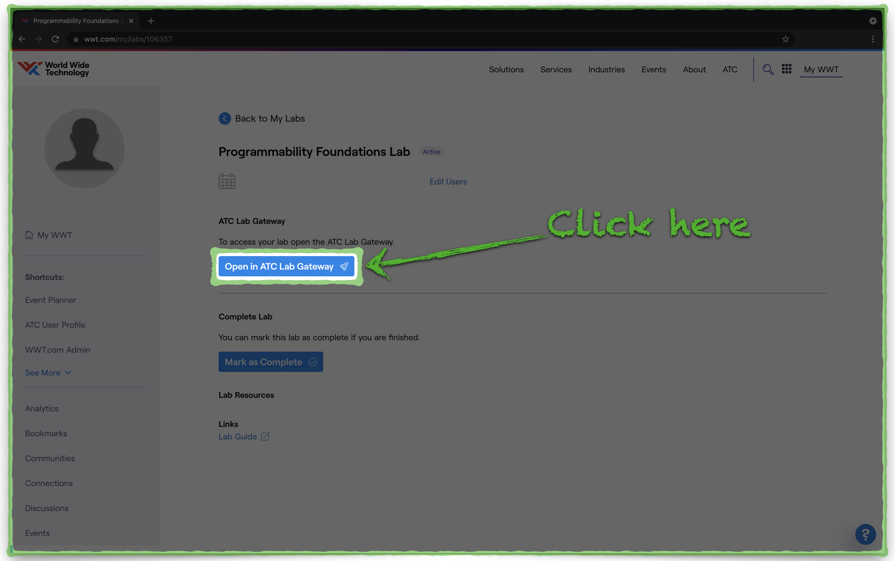
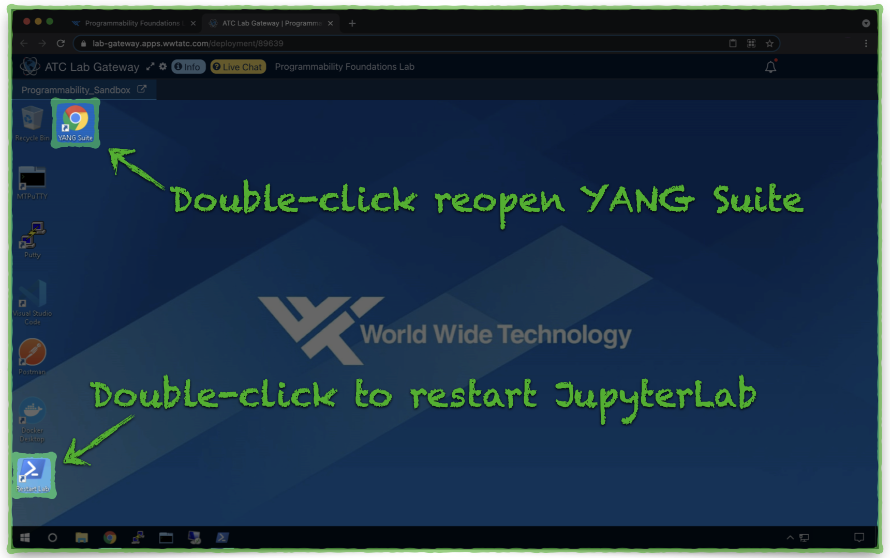

# Getting Started With The Lab

## :fontawesome-solid-flask: Lab Overview

The lab environment runs in the [WWT Programmability Foundations On-Demand Lab](https://www.wwt.com/lab/programmability-foundations-lab "WWT Programmability Foundations On-Demand Lab"){target=_blank} using an MDP exploration tool called [YANG Suite](https://developer.cisco.com/yangsuite/ "YANG Suite Home Page"){target=_blank} and a web-based, interactive Python environment called [JupyterLab](https://jupyterlab.readthedocs.io/en/stable/getting_started/overview.html "JupyterLab Overview & User Guide"){target=_blank}.

- YANG Suite will allow you to explore YANG models and construct NETCONF RPC messages bodies using a web browser.
- JupyterLab will allow you to work through a series of YANG Suite tasks plus several Python-based **NETCONF** exercises using a web browser.

---

## :fontawesome-solid-atom: Lab Requirements

You only need a few things to start working through the labs:

1. :fontawesome-brands-chrome: A computer with the [Google Chrome](https://www.google.com/chrome/ "Google Chrome Download"){target=_blank} web browser.

    - We test access to the lab environment with Chrome, and you may experience issues with other web browsers.

2. :fontawesome-solid-user-circle: An account on [wwt.com](https://www.wwt.com/login "World Wide Technology Digital Platform Login"){target=_blank}.

---

## :material-beaker: Lab Setup Instructions

The lab setup process is mostly automated although you will have to manually:

1. :fontawesome-solid-laptop-code: launch a lab environment instance.
2. :material-powershell: Use a command to initiate the automated lab build.

???+ abstract "Auto-provision the hands-on environment in the WWT Programmability Foundations Lab"

    ???+ todo "Step 1"

        Launch a new copy of the [WWT Programmability Foundations On-Demand Lab](https://www.wwt.com/lab/programmability-foundations-lab "WWT Programmability Foundations On-Demand Lab"){target=_blank} and click [View Labs](https://www.wwt.com/my/labs "My WWT Labs"){target=_blank}:

        [](../images/pf_lab/1_launch_lab.png){target=_blank}

    ??? todo "Step 2"

        From the [My Labs](https://www.wwt.com/my-wwt/labs "My WWT Labs"){target=_blank} page, click **Access Lab**:

        [](../images/pf_lab/2_access_lab.png){target=_blank}

    ??? todo "Step 3"

        Click the **Open in ATC Lab Gateway button**:

        [](../images/pf_lab/3_open_lab.png){target=_blank}

    ??? todo "Step 4"

        If prompted, log on with your [wwt.com Platform Account Credentials](https://www.wwt.com/login "WWT.com Platform Login"){target=_blank}:

        [](../images/pf_lab/4_lab_authenticate.png){target=_blank}

    ??? todo "Step 5"

        Click the **System Tray icon** and mouse over the **Docker icon** to reveal the service status:

        !!! attention
            The icon may take a minute or so to appear.

        [](../images/pf_lab/5_wait_for_docker.png){target=_blank}

    ??? todo "Step 6"

        The Docker service is ready when a small exclamation point appears over the **Docker icon**:

        !!! attention
            It may be a few minutes before the Docker service is ready.

        [](../images/pf_lab/6_docker_startup_complete.png){target=_blank}

        ???+ danger "Important"
            Occasionally, the Docker Desktop service does not start on its own. Windows may ask you if you want to start the Docker service and then request permission for Net Command​ to run. You may safely confirm both actions.

            <p align="center">
                [](../images/pf_lab/13_start_docker.png){target=_blank}
            </p>

            ---

            <p align="center">
                [](../images/pf_lab/14_start_docker_uac.png){target=_blank}
            </p>

    ??? todo "Step 7"

        A PowerShell script will automatically customize the lab environment, but you need to paste a long command into a PowerShell window to start that process.:

        !!! tip "Details"
            1. Copy this entire command to your clipboard:

                - :fontawesome-solid-exclamation-circle: Tip: move your mouse cursor over the command text and click the :material-content-copy: icon at the far right-hand side of the command block.

                ```powershell
                Set-Executionpolicy -Scope CurrentUser -ExecutionPolicy UnRestricted -Force; Set-Location \Users\admin; Invoke-WebRequest -Uri 'https://devasc-netconf.s3-us-west-2.amazonaws.com/setup_lab.ps1' -OutFile 'setup_lab.ps1’; .\setup_lab.ps1
                ```

            2. On the Windows desktop, click the PowerShell icon in the taskbar to open a new PowerShell window.
            3. Right-click in the PowerShell window to paste the command
            4. Press your ++enter++ or ++"Return"++ key to run the command.

            [](../images/pf_lab/7_paste_ps_commands.png){target=_blank}

        ??? error "What to do if you see a 'Docker Desktop process is not running' error message:"

            - From time to time, the Windows desktop in this lab takes a lengthy amount of time to successfully start the Docker Desktop process and, rarely, Windows will fail to start Docker Desktop. If Windows cannot start Docker Desktop, your first indication will be an error message when you run the PowerShell script that configures the lab.

                [](../images/pf_lab/15_start_docker_error.png){target=_blank}

                ---

            ???+ attention "Docker for Windows Process Status"

                - As the PowerShell error message indicates, PowerShell will attempt to start or restart the Docker Desktop process. After a few seconds, the Docker Desktop application will open behind the PowerShell window, and you may bring it to the foreground to monitor the status.
                
                - ==A teal-colored icon== in the lower-left corner of the Docker Desktop application indicates the Docker process is running and you should be able to re-run the PowerShell script to configure the lab environment. Sometimes, Windows takes 5-10 minutes to start the Docker process.

                - ==An orange-colored icon== in the lower-left corner of the Docker Desktop application indicates the Docker process is not running and you have a couple of options:

                    1. Wait for around 10 minutes to see if Windows can start the Docker process.
                    2. Launch a new instance of the [WWT Programmability Foundations On-Demand Lab](https://www.wwt.com/lab/programmability-foundations-lab "WWT Programmability Foundations On-Demand Lab"){target=_blank}.

                [](../images/pf_lab/16_docker_status.png){target=_blank}

    ??? todo "Step 8"

        Wait a few minutes for the automated lab setup to complete:

        [](../images/pf_lab/8_jupyter_setup.png){target=_blank}

    ??? todo "Step 9"

        Within a few minutes, when the lab is ready to use, a Chrome browser will open a **JupyterLab URL**.  Open the **devasc-netconf-intro** folder from the navigation pane:

        !!! attention
            A few minutes after the JupyterLab browser window opens, a second Chrome tab will open for YANG Suite.

            - Switch back to the JupyterLab tab when this happens.
            - The instructions in the JupyterLab Notebook will show you how to use YANG Suite.

        [](../images/pf_lab/9_jupyter_nav_1.png){target=_blank}

    ??? todo "Step 10"

        Next, open the **lab** folder:

        [](../images/pf_lab/10_jupyter_nav_2.png){target=_blank}

    ??? todo "Step 11"

        Open the file **ncclient_with_output.ipynb** and follow the step-by-step instructions in the main pane:

        [](../images/pf_lab/11_jupyter_nav_3.png){target=_blank}

    ??? help "Lab Restart Instructions"

        The lab setup process creates two shortcuts on the Windows desktop, which will help you restore the lab environment in the event the JupyterLab or YANG Suite browser tabs close, Windows restarts, etc.

        !!! attention "Notice"

            - The **Restart Lab** and **YANG Suite** shortcuts re-launch JupyterLab or YANG Suite, respectively (including the Chrome browser tabs), within a few seconds; much sooner than during the initial lab setup.
            - Double-clicking these shortcuts will **NOT** cause you to lose any of your lab progress.

        [](../images/pf_lab/12_lab_restart.png){target=_blank}

--8<-- "includes/glossary.txt"
